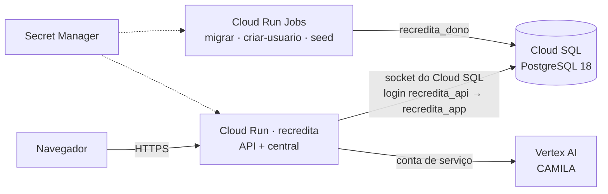

# Infraestrutura — staging e produção

> Rodando num servidor próprio com Easypanel? Veja [easypanel.md](easypanel.md).

Google Cloud em São Paulo (`southamerica-east1`): Cloud Run, Cloud SQL para PostgreSQL 18, Secret Manager e Artifact Registry. Todo dado fica no Brasil, o que simplifica a homologação pelos bancos (Res. CMN 4.893/2021).

> **O que já foi validado e o que não foi.** A imagem, o fluxo de banco (dono sem superusuário, login da API só com o papel da aplicação), os jobs e as jornadas E2E contra a imagem rodaram localmente e rodam no CI (job `imagem`, em `.github/workflows/ci.yml`). Os comandos `gcloud` abaixo seguem a referência oficial, mas **ainda não foram executados num projeto real**: revise-os na primeira subida.

## Visão geral



Uma imagem só (`Dockerfile` na raiz). O serviço atende `/api` e serve a central na mesma origem — é o que sustenta o cookie `__Host-sessao` (Secure, HttpOnly, SameSite=Strict) sem CORS. As tarefas de operação são a mesma imagem com outro comando:

| Comando | Para quê | Conecta como |
| --- | --- | --- |
| `node dist/principal.js` (padrão) | o serviço | `recredita_api` |
| `node dist/migrar.js` | migrações; com `LOGIN_DA_API`, concede o papel da aplicação ao login da API | `recredita_dono` |
| `node dist/criar-usuario.js <email> <nome> <papel> [canal...]` | usuário pela linha de comando; senha em `SENHA_INICIAL` | `recredita_dono` |
| `node dist/seed.js` | dados sintéticos — **só staging**; em produção exige `SEMEAR_DADOS_SINTETICOS=sim` e recusa sem ele | `recredita_dono` |

## Ambientes

Dois projetos separados — por exemplo `recredita-staging` e `recredita-prod`. Dado real de devedor só existe em produção; projetos separados isolam IAM, segredos e faturamento, e um erro em staging não alcança produção.

## Papéis do banco

O isolamento entre tenants e entre os planos A e B é imposto pelo banco (RLS). Isso só vale se a API **nunca** conectar como dono das tabelas — o dono fura o RLS.

| Papel | Quem cria | Para quê |
| --- | --- | --- |
| `recredita_dono` | você, uma vez | dono das tabelas: migrações e CLIs. Não é superusuário. |
| `recredita_api` | você, uma vez | login do serviço. Nenhum privilégio próprio além de ser membro de `recredita_app`. |
| `recredita_app` | a migração `0001` | papel com que toda transação da API roda (`SET LOCAL ROLE`). Sem login. Vê só o tenant e os canais da sessão. |

Só quem criou `recredita_app` (o dono, na primeira migração) pode concedê-lo; por isso o job de migração faz a concessão quando recebe `LOGIN_DA_API`.

## Primeira subida

Variáveis usadas nos comandos:

```bash
PROJETO=recredita-staging
REGIAO=southamerica-east1
INSTANCIA=recredita
CONEXAO=$PROJETO:$REGIAO:$INSTANCIA
IMAGEM=$REGIAO-docker.pkg.dev/$PROJETO/recredita/app
VERSAO=$(git rev-parse --short HEAD)
SA_API=recredita-api@$PROJETO.iam.gserviceaccount.com
SA_OPERACAO=recredita-operacao@$PROJETO.iam.gserviceaccount.com
```

### 1. APIs e repositório de imagens

```bash
gcloud services enable run.googleapis.com sqladmin.googleapis.com secretmanager.googleapis.com \
  artifactregistry.googleapis.com aiplatform.googleapis.com --project $PROJETO
gcloud artifacts repositories create recredita --repository-format docker --location $REGIAO --project $PROJETO
```

### 2. Cloud SQL

```bash
gcloud sql instances create $INSTANCIA --project $PROJETO --region $REGIAO \
  --database-version POSTGRES_18 --edition enterprise --cpu 1 --memory 3840MiB \
  --availability-type zonal --backup-start-time 06:00 --enable-point-in-time-recovery \
  --deletion-protection
gcloud sql users set-password postgres --instance $INSTANCIA --project $PROJETO --prompt-for-password
```

- PostgreSQL 18 é a mesma versão do PGlite (desenvolvimento e testes) e do Postgres do CI.
- Backup às 06:00 UTC (03:00 em Brasília), com recuperação para um ponto no tempo.
- Produção: `--availability-type regional` (alta disponibilidade) e avaliar `--edition enterprise-plus`.
- O serviço conecta pelo conector do Cloud SQL (socket autenticado por IAM): o IP público pode ficar sem nenhuma rede autorizada. IP privado (`--network`, `--no-assign-ip`) exige VPC com acesso privado a serviços — passo para quando houver VPC.

### 3. Papéis e banco

No Cloud SQL Studio (console), conectado como `postgres`. Use senhas geradas só com letras e números (`openssl rand -hex 24`): elas entram numa URL, e caractere especial exigiria codificação.

```sql
create role recredita_dono login createrole password '<senha do dono>';
create role recredita_api login password '<senha da API>';
-- O postgres do Cloud SQL não é superusuário: precisa ser membro para entregar o banco ao dono.
grant recredita_dono to postgres;
create database recredita owner recredita_dono;
```

### 4. Segredos

A URL usa `localhost` com o socket no parâmetro `host`. O driver `pg` conecta pelo socket; o `localhost` está ali porque a API valida `DATABASE_URL` como URL, e uma URL sem host é inválida.

```bash
printf '%s' "postgres://recredita_dono:<senha do dono>@localhost/recredita?host=/cloudsql/$CONEXAO" \
  | gcloud secrets create recredita-db-dono --data-file=- --project $PROJETO
printf '%s' "postgres://recredita_api:<senha da API>@localhost/recredita?host=/cloudsql/$CONEXAO" \
  | gcloud secrets create recredita-db-api --data-file=- --project $PROJETO
openssl rand -hex 32 | tr -d '\n' | gcloud secrets create recredita-segredo-sessao --data-file=- --project $PROJETO
```

### 5. Contas de serviço

Uma para o serviço, outra para os jobs — o serviço nunca recebe a credencial do dono.

```bash
gcloud iam service-accounts create recredita-api --project $PROJETO
gcloud iam service-accounts create recredita-operacao --project $PROJETO

for papel in roles/cloudsql.client roles/aiplatform.user; do
  gcloud projects add-iam-policy-binding $PROJETO --member serviceAccount:$SA_API --role $papel
done
gcloud projects add-iam-policy-binding $PROJETO --member serviceAccount:$SA_OPERACAO --role roles/cloudsql.client

for segredo in recredita-db-api recredita-segredo-sessao; do
  gcloud secrets add-iam-policy-binding $segredo --project $PROJETO \
    --member serviceAccount:$SA_API --role roles/secretmanager.secretAccessor
done
gcloud secrets add-iam-policy-binding recredita-db-dono --project $PROJETO \
  --member serviceAccount:$SA_OPERACAO --role roles/secretmanager.secretAccessor
```

### 6. Imagem

O build usa recursos do BuildKit (cache de dependências). É o mesmo build que o CI valida:

```bash
gcloud auth configure-docker $REGIAO-docker.pkg.dev
docker build -t $IMAGEM:$VERSAO .
docker push $IMAGEM:$VERSAO
```

### 7. Migração

```bash
gcloud run jobs deploy recredita-migrar --project $PROJETO --region $REGIAO \
  --image $IMAGEM:$VERSAO --command node --args dist/migrar.js \
  --service-account $SA_OPERACAO --set-cloudsql-instances $CONEXAO \
  --set-secrets DATABASE_URL=recredita-db-dono:latest --set-env-vars LOGIN_DA_API=recredita_api \
  --max-retries 0 --task-timeout 10m
gcloud run jobs execute recredita-migrar --project $PROJETO --region $REGIAO --wait
```

A saída esperada termina com `recredita_api conecta como recredita_app`.

### 8. Serviço

```bash
gcloud run deploy recredita --project $PROJETO --region $REGIAO --image $IMAGEM:$VERSAO \
  --service-account $SA_API --add-cloudsql-instances $CONEXAO \
  --set-secrets DATABASE_URL=recredita-db-api:latest,SEGREDO_SESSAO=recredita-segredo-sessao:latest \
  --set-env-vars GOOGLE_CLOUD_PROJECT=$PROJETO \
  --allow-unauthenticated --cpu 1 --memory 512Mi --min-instances 0 --max-instances 4
```

- `--allow-unauthenticated`: a central é pública e a autenticação é a da aplicação. Organizações com a política de domínios permitidos ligada precisam de exceção para `allUsers`.
- Produção: `--min-instances 1` evita a primeira requisição lenta.
- Domínio próprio: um Application Load Balancer externo com NEG serverless também dá certificado gerenciado e Cloud Armor (WAF). Com ele, o rate limit do login continua lendo o IP real (a API confia no `X-Forwarded-For` em produção).

Conferência: `curl https://<url do serviço>/api/saude` responde `{"ok":true,…}`.

### 9. Primeiro usuário

A senha vai por segredo, não por argumento (argumentos ficam visíveis na execução):

```bash
openssl rand -hex 16 | tr -d '\n' | gcloud secrets create recredita-senha-inicial --data-file=- --project $PROJETO
gcloud secrets add-iam-policy-binding recredita-senha-inicial --project $PROJETO \
  --member serviceAccount:$SA_OPERACAO --role roles/secretmanager.secretAccessor

gcloud run jobs deploy recredita-criar-usuario --project $PROJETO --region $REGIAO \
  --image $IMAGEM:$VERSAO --command node --args dist/criar-usuario.js \
  --service-account $SA_OPERACAO --set-cloudsql-instances $CONEXAO \
  --set-secrets DATABASE_URL=recredita-db-dono:latest,SENHA_INICIAL=recredita-senha-inicial:latest \
  --max-retries 0
gcloud run jobs execute recredita-criar-usuario --project $PROJETO --region $REGIAO --wait \
  --args "dist/criar-usuario.js,admin@<domínio>,<Nome Completo>,admin"
```

Leia a senha (`gcloud secrets versions access latest --secret recredita-senha-inicial`), guarde-a no cofre de senhas da equipe e destrua a versão do segredo. Ainda não há troca de senha pela tela: a senha inicial é a senha do usuário.

Os demais usuários se criam pela tela **Gestão → Usuários**.

### 10. Seed sintético (só staging)

```bash
gcloud run jobs deploy recredita-seed --project $PROJETO --region $REGIAO \
  --image $IMAGEM:$VERSAO --command node --args dist/seed.js \
  --service-account $SA_OPERACAO --set-cloudsql-instances $CONEXAO \
  --set-secrets DATABASE_URL=recredita-db-dono:latest --set-env-vars SEMEAR_DADOS_SINTETICOS=sim \
  --max-retries 0
gcloud run jobs execute recredita-seed --project $PROJETO --region $REGIAO --wait
```

Nunca crie este job no projeto de produção.

## Versão nova

1. `docker build` e `docker push` com a nova `$VERSAO`.
2. `gcloud run jobs update recredita-migrar --image $IMAGEM:$VERSAO …` e `gcloud run jobs execute recredita-migrar --wait`.
3. `gcloud run deploy recredita --image $IMAGEM:$VERSAO …`.

A migração roda **antes** do deploy, com a versão anterior ainda no ar. Por isso toda migração precisa ser compatível com o código anterior: primeiro adiciona (coluna nova, opcional), o código passa a usar, e só numa versão seguinte remove o que ficou sem uso. Migração já aplicada nunca é editada — o migrador confere o checksum e recusa.

## Variáveis de ambiente do serviço

| Variável | Origem | Observação |
| --- | --- | --- |
| `NODE_ENV` | imagem (`production`) | ativa cookie `__Host-`, `trustProxy`, logs para o Cloud Logging; desliga `/docs` |
| `PORT` | Cloud Run | a imagem usa 8080 por padrão |
| `CENTRAL_DIR`, `MIGRACOES_DIR` | imagem | build da central e migrações dentro do container |
| `DATABASE_URL` | segredo `recredita-db-api` | obrigatória em produção (sem ela a API não sobe) |
| `SEGREDO_SESSAO` | segredo `recredita-segredo-sessao` | 32+ caracteres; trocar invalida só os tokens CSRF — a tela busca um novo ao recarregar, a sessão continua |
| `GOOGLE_CLOUD_PROJECT` | `--set-env-vars` | liga a CAMILA via Vertex AI |
| `GOOGLE_CLOUD_LOCATION` | opcional | padrão `southamerica-east1` |
| `CAMILA_MODELO` | opcional | padrão `gemini-3-flash-preview` |

## CAMILA (Vertex AI)

Sem `GOOGLE_CLOUD_PROJECT`, a CAMILA responde 503 e as telas dizem que ela está indisponível — o resto funciona. Com o projeto, a conta do serviço precisa de `roles/aiplatform.user`.

Confirme que o modelo configurado existe em `southamerica-east1`. Modelos em preview costumam sair só em `global` ou nos EUA; usá-los manda o payload para fora do Brasil. O payload já vai pseudonimizado, mas a transferência internacional (LGPD, art. 33) é decisão do jurídico, não da configuração.

## Logs

Em produção a API escreve JSON com `severity`, `message` e `time` — o formato que o Cloud Logging lê. Erros aparecem com:

```
resource.type="cloud_run_revision" AND resource.labels.service_name="recredita" AND severity>=ERROR
```

## Segurança — o que a configuração garante

- A API nunca conecta como dono: tenant e canal são impostos pelo banco mesmo se uma rota esquecer o filtro.
- Segredos só no Secret Manager. A imagem não carrega `.env` (`.dockerignore`, e o pacote da API publica só `dist/`).
- `/docs` (Swagger) só fora de produção.
- Seed sintético recusado em produção sem a flag explícita.
- Login com rate limit por IP (10 por minuto).

## Pendências desta infraestrutura

- Projeto GCP criado e estes comandos executados uma vez (staging).
- Deploy pelo GitHub Actions com Workload Identity Federation — sem chave JSON de conta de serviço.
- Cloud Storage para documentos e evidências (fase 2a, junto com o upload).
- Observabilidade além dos logs: rastreamento e alertas (plano, fase 4).
